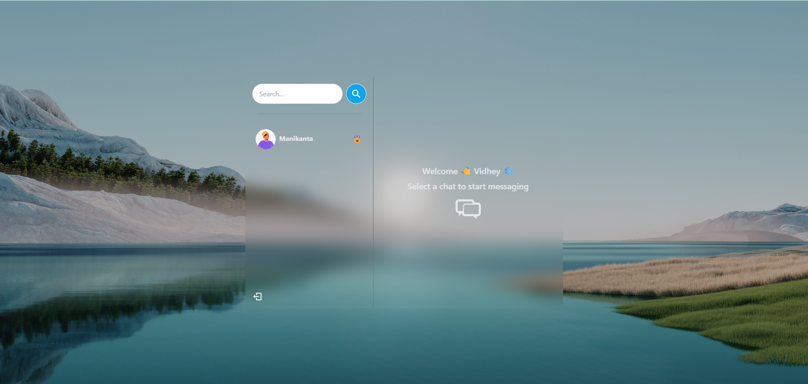

# Chit-Chat 💬

A real-time chat application with user authentication, built using **Zustand**, **React**, **Node.js**, **Express**, **MongoDB**, and **Socket.io**.

🌐 **Live Demo:** [https://chitchat071.netlify.app/](https://chitchat071.netlify.app/)

 <!-- Add screenshot in public folder if not already -->

---

## 🚀 Features

- ✅ Real-time chat using WebSockets
- 🔐 Secure login and registration
- 🔁 JWT-based authentication with token refresh
- 🧠 User presence and online status indicators
- 📦 MongoDB for persistent message storage
- 💻 Clean, responsive UI (React)

---

## 🛠️ Tech Stack

**Frontend:**
- React
- TailwindCSS
- React Router
- Context API

**Backend:**
- Zustand
- Node.js
- Express.js
- MongoDB with Mongoose
- Socket.io
- JWT for Auth

---

## 🧑‍💻 Local Development Setup

> Make sure you have **Node.js** and **MongoDB** installed.

### 1️⃣ Clone the repository

```bash
git clone https://github.com/Vidhey012/ChitChat.git
cd ChatBot
```

---

### 2️⃣ Setup the Backend

```bash
cd backend
npm install
```

#### Create a `.env` file inside the `backend/` directory:

```env
PORT=5000 \
MONGO_DB_URI=your_mongodb_uri \
JWT_SECRET=your_jwt_secret \
REFRESH_TOKEN_SECRET=your_jwt_refresh_secret 
ACCESS_TOKEN_SECRET=your_jwt_access_secret \
NODE_ENV=development
```

### 3️⃣ Start the Backend

```bash
npm run dev
```

---

### 4️⃣ Setup the Frontend

```bash
cd ../frontend
npm install
npm start
```

The app will open on `http://localhost:3000`

---

## 🧪 Testing the App

- Register a new user
- Login and start chatting
- Messages persist via MongoDB
- Chat updates in real-time via Socket.io

---

## 🙋‍♂️ Contributing

1. Fork the project
2. Create your feature branch (`git checkout -b feature/AmazingFeature`)
3. Commit your changes (`git commit -m 'Add some AmazingFeature'`)
4. Push to the branch (`git push origin feature/AmazingFeature`)
5. Open a Pull Request

## 🚀 Go Live
#### The application is hosted and live at:
🔗 [https://chitchat071.netlify.app/](https://chitchat071.netlify.app/)
